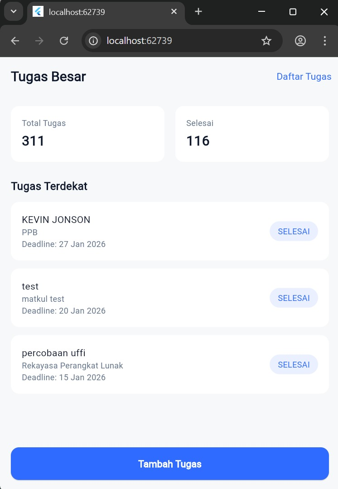
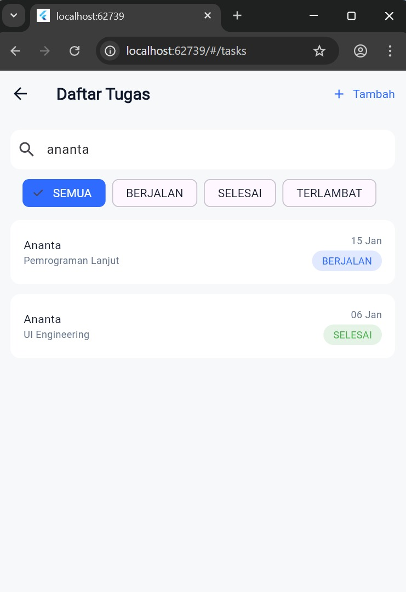
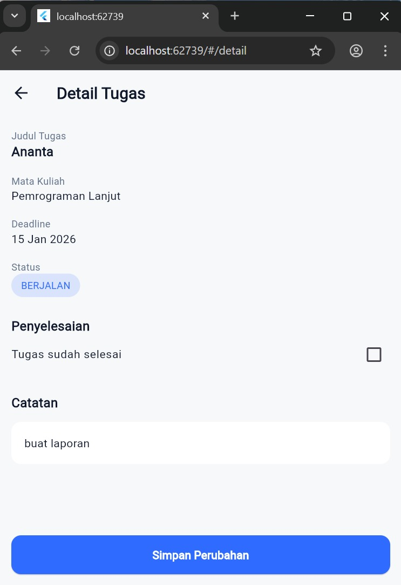
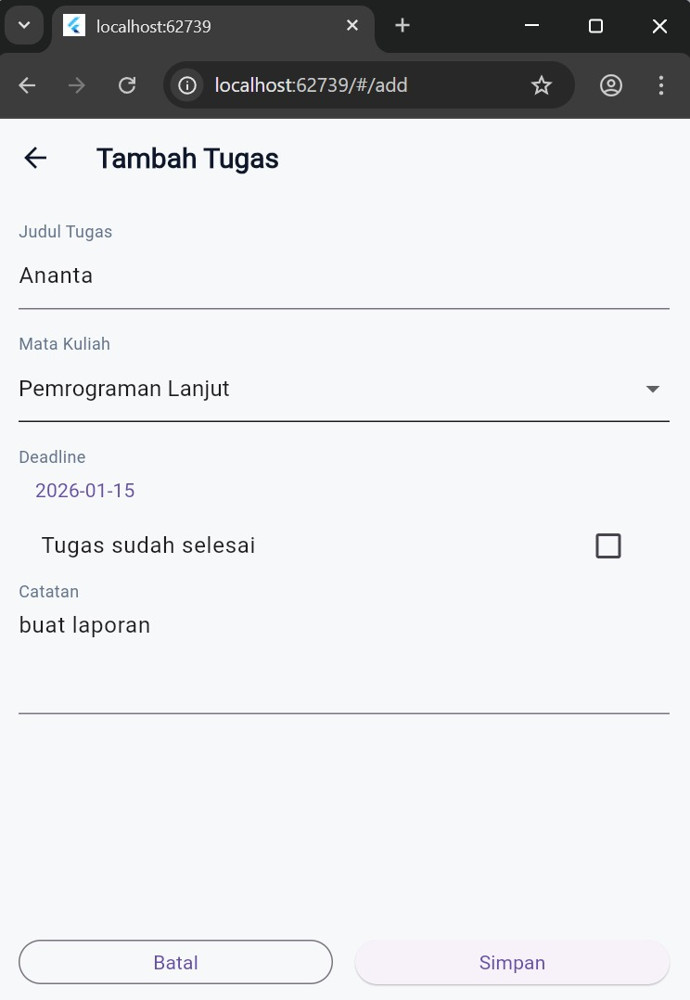

# COTS_PPB_MuhammadRifqiAlBaqiAnanta
Project ini merupakan aplikasi Manajemen Tugas (Task Manager) berbasis Flutter yang dibuat untuk memenuhi kebutuhan COTS (Commercial Off-The-Shelf) pada mata kuliah Pemrograman Perangkat Bergerak.

Aplikasi ini mengimplementasikan CRUD lengkap, arsitektur terstruktur, integrasi Supabase REST API, serta tampilan yang disesuaikan dengan desain yang ditentukan dosen.

# 🎯 Tujuan Project 🎯
1. Mengimplementasikan frontend Flutter
2. Mengelola data melalui REST API (GET, POST, PATCH)
3. Menerapkan arsitektur pemrograman terstruktur
4. Menggunakan Supabase sebagai Backend-as-a-Service
5. Menyesuaikan UI dengan design system yang konsisten
   
# 📂 Struktur Folder 📂
```
lib/
│
├── core/
│ ├── config/
│ │ └── supabase_config.dart
│ └── services/
│ └── task_service.dart
│
├── data/
│ └── models/
│ └── task_model.dart
│
├── design_system/
│ ├── colors.dart
│ ├── typography.dart
│ └── spacing.dart
│
├── presentation/
│ ├── dashboard/
│ │ └── dashboard_page.dart
│ ├── task_list/
│ │ └── task_list_page.dart
│ ├── task_detail/
│ │ └── task_detail_page.dart
│ └── task_add/
│ └── task_add_page.dart
│
└── main.dart
```
# 📌 Fitur Aplikasi 📌
✅ Dashboard
- Menampilkan ringkasan jumlah tugas
- Menampilkan Tugas Terdekat
- Navigasi cepat ke detail tugas

📋 Daftar Tugas
- Menampilkan seluruh tugas
- Search bar (judul & mata kuliah)
- Filter status:
1. Semua
2. Berjalan
3. Selesai
4. Terlambat

🔍 Detail Tugas
- Menampilkan detail lengkap tugas
- Checkbox untuk mengubah status selesai
- Update status menggunakan PATCH API

➕ Tambah Tugas
- Form input tugas
- Validasi input
- Tidak dapat memilih tanggal sebelum hari ini
- Simpan data menggunakan POST API

# 📱 Dokumentasi Aplikasi📱
1. Dashboard
   
2. Daftar Tugas
   
3. Detail Tugas
   
4. Tambah Tugas
   
